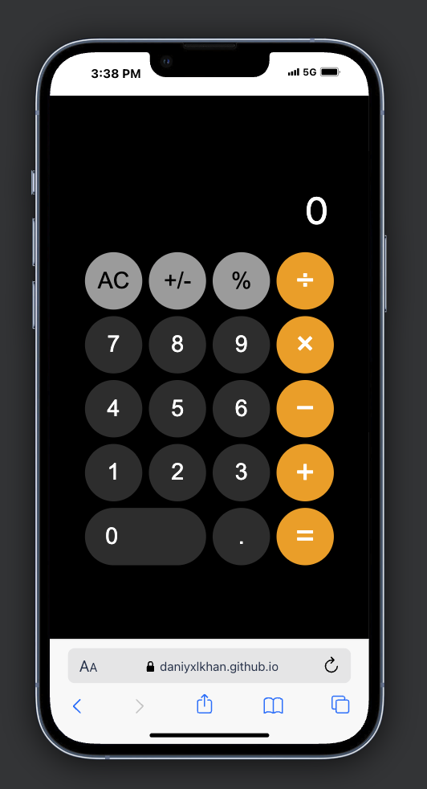

# iOS-Inspired Calculator

A lightweight, browser-based calculator app inspired by the iOS calculator. Built using vanilla JavaScript, HTML, and CSS. This project handles basic arithmetic operations and updates the display dynamically as the user interacts.

  

